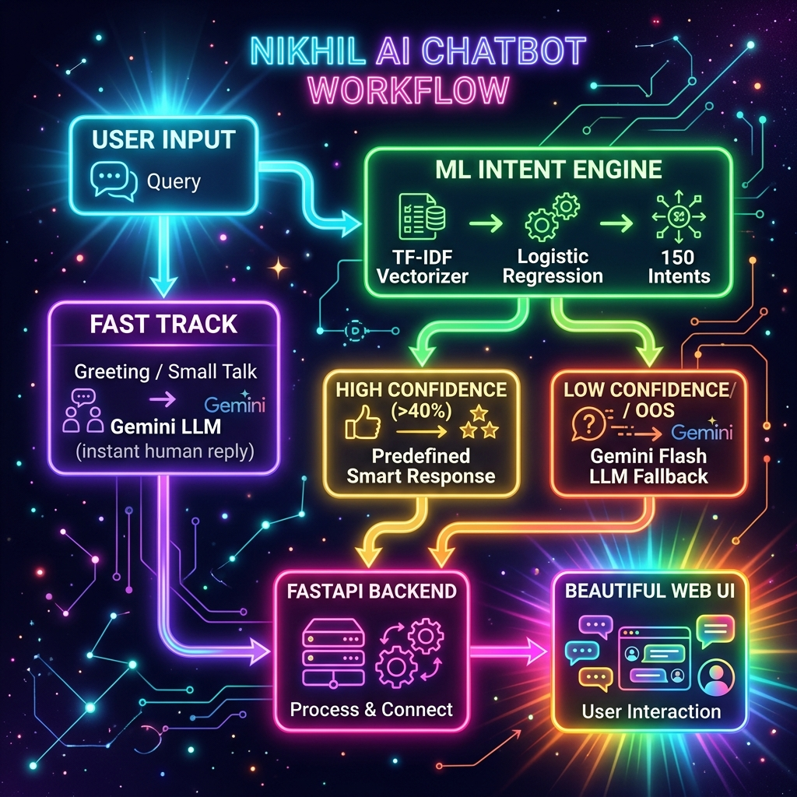

<div align="center">


<br/>


<br/>

> **A production-grade AI Chatbot** that combines a trained Machine Learning model (CLINC150 dataset) with Google Gemini LLM — so it can answer *any* human question, naturally and intelligently!

</div>

---

## ✨ Features

| Feature | Description |
|---|---|
| 🧠 **ML Intent Engine** | TF-IDF + Logistic Regression trained on 15,250 samples across 150 intents |
| 🤖 **Gemini LLM Fallback** | Answers *any* question outside trained intents using Google Gemini Flash |
| 💬 **Human-like Conversation** | Casual, friendly replies with context memory (remembers last 3 exchanges) |
| ⚡ **FastAPI Backend** | High-performance async REST API with health checks and metrics |
| 🎨 **Premium UI** | Glassmorphism design with typing indicators, session stats, and dark mode |
| 📊 **Model Metrics** | Real-time accuracy, F1 score, confidence display in sidebar |
| 🔒 **Secure** | API key managed via environment variables |

---

## 🗺️ Workflow Diagram

<div align="center">

</div>

---

## 🚀 Quick Start

### 1. Clone the Repository
```bash
git clone https://github.com/viRAJ357/Nikhil-Chatbot.git
cd Nikhil-Chatbot
```

### 2. Install Dependencies
```bash
pip install -r requirements.txt
```

### 3. Train the Model
```bash
python train.py
```
> ⏱️ This will download the CLINC150 dataset from HuggingFace and train 3 models, selecting the best one (~82% accuracy on test set).

### 4. Get a Free Gemini API Key
1. Go to [Google AI Studio](https://aistudio.google.com/app/apikey)
2. Click **Create API Key**
3. Copy your key

### 5. Run the Chatbot
```bash
# Windows (PowerShell)
$env:GEMINI_API_KEY="your_api_key_here"; python app.py

# Linux / Mac
GEMINI_API_KEY="your_api_key_here" python app.py
```

### 6. Open in Browser
```
http://localhost:8000
```

---

## 🧠 How It Works

```
User Message
     │
     ▼
┌─────────────────────────────────────────┐
│          ML Intent Classifier            │
│  TF-IDF Vectorizer → Logistic Regression │
│         (150 CLINC Intents)              │
└──────────┬──────────────────┬───────────┘
           │                  │
    Confidence ≥ 40%   Confidence < 40%
    or Known Intent    or Out-of-Scope
           │                  │
           ▼                  ▼
  ┌─────────────┐    ┌──────────────────┐
  │  Predefined │    │  Gemini Flash LLM│
  │  Smart Reply│    │  (Human-like AI) │
  └──────┬──────┘    └────────┬─────────┘
         │                    │
         └──────────┬─────────┘
                    ▼
            FastAPI Response
                    │
                    ▼
           Beautiful Web UI 🎨
```

---

## 📁 Project Structure

```
Nikhil-Chatbot/
│
├── app.py               # FastAPI application & REST API routes
├── chatbot_engine.py    # Core chatbot logic + Gemini LLM integration
├── train.py             # Model training pipeline (3 models compared)
├── preprocess.py        # TF-IDF preprocessing pipeline
├── predict.py           # Inference / prediction logic
├── evaluate.py          # Model evaluation utilities
├── config.py            # Central configuration (paths, hyperparameters)
├── requirements.txt     # Python dependencies
├── workflow.png         # System architecture diagram
│
├── static/
│   ├── style.css        # Premium glassmorphism UI styles
│   └── app.js           # Frontend chat logic
│
├── templates/
│   └── index.html       # Chat UI template
│
└── model/               # Auto-generated after training
    ├── best_model.joblib
    ├── tfidf_vectorizer.joblib
    ├── label_encoder.joblib
    ├── metrics.json
    └── model_info.json
```

---

## 📊 Model Performance

| Metric | Score |
|---|---|
| **Train Split** | 15,250 samples |
| **Validation Split** | 3,100 samples |
| **Test Split** | 5,500 samples |
| **Test Accuracy** | **82.24%** |
| **F1 Macro** | **85.80%** |
| **Best Model** | Logistic Regression |
| **Intents** | 150 classes |

---

## 🛠️ Tech Stack

- **Backend**: Python 3.12+, FastAPI, Uvicorn
- **ML**: scikit-learn, TF-IDF, Logistic Regression, Linear SVM
- **Dataset**: [CLINC150](https://huggingface.co/datasets/clinc/clinc_oos) (HuggingFace)
- **LLM**: Google Gemini Flash (via `google-generativeai`)
- **Frontend**: Vanilla HTML + CSS + JavaScript (Glassmorphism Design)
- **Serialization**: Joblib

---

## 📄 License

This project is licensed under the **MIT License** — feel free to use, modify, and distribute.

---

<div align="center">

**Made with ❤️ by Nikhil**

⭐ If you find this project useful, please give it a **star**!

</div>
